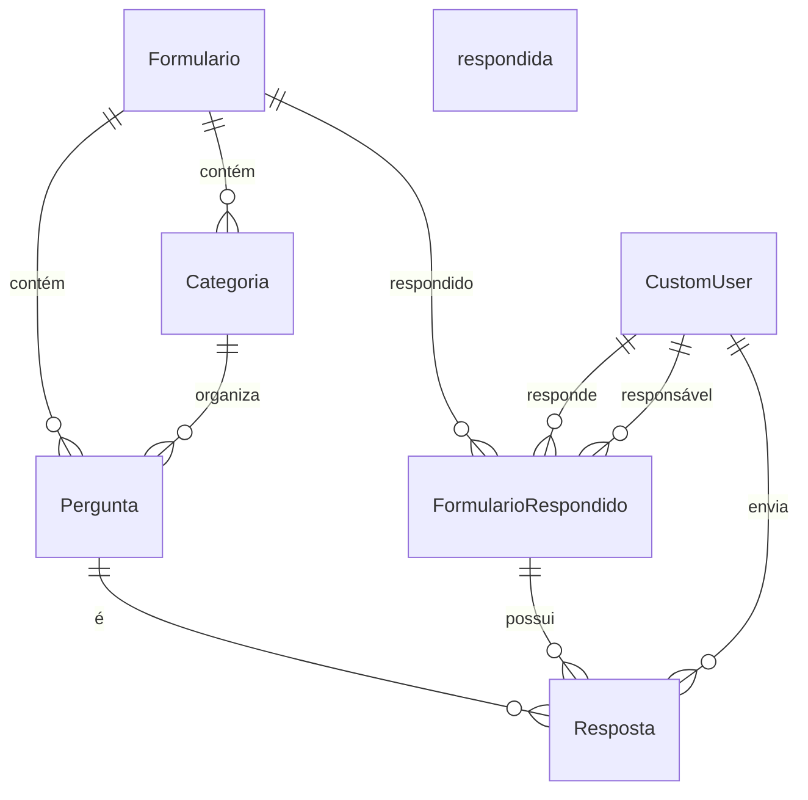

# 📚 Documentação do Banco de Dados do form

## 🔹 Visão Geral

Este banco de dados é utilizado para armazenar formulários, suas respectivas categorias e perguntas, bem como as respostas submetidas por usuários. Ele está relacionado ao módulo de **formulários e respostas** de um sistema de avaliação/mapeamento.

---

## 🧩 Entidades e Relacionamentos

### 📄 Formulario

| Campo | Tipo           | Obrigatório | Único | Descrição           |
| ----- | -------------- | ----------- | ----- | ------------------- |
| id    | AutoField (PK) | Sim         | Sim   | Identificador único |
| nome  | CharField(255) | Sim         | Sim   | Nome do formulário  |

Relacionamentos:

- 1 formulário → N categorias (`Categoria`)
- 1 formulário → N perguntas (`Pergunta`)
- 1 formulário → N formulários respondidos (`FormularioRespondido`)

---

### 📄 Categoria

| Campo         | Tipo                    | Obrigatório | Único | Descrição                   |
| ------------- | ----------------------- | ----------- | ----- | --------------------------- |
| id            | AutoField (PK)          | Sim         | Sim   | Identificador único         |
| nome          | CharField(255)          | Sim         | Sim   | Nome da categoria           |
| formulario_id | ForeignKey → Formulario | Sim         | -     | Formulário ao qual pertence |

Relacionamentos:

- 1 categoria → N perguntas (`Pergunta`)

---

### 📄 Pergunta

| Campo         | Tipo                    | Obrigatório | Único | Descrição                                |
| ------------- | ----------------------- | ----------- | ----- | ---------------------------------------- |
| id            | AutoField (PK)          | Sim         | Sim   | Identificador único                      |
| questao       | TextField               | Sim         | -     | Texto da pergunta                        |
| codigo        | CharField(50)           | Sim         | Sim   | Código identificador da pergunta         |
| categoria_id  | ForeignKey → Categoria  | Sim         | -     | Categoria da pergunta                    |
| formulario_id | ForeignKey → Formulario | Não         | -     | (Opcional) Formulário direto da pergunta |

Relacionamentos:

- 1 pergunta → N respostas (`Resposta`)

---

### 📄 FormularioRespondido

| Campo          | Tipo                    | Obrigatório | Único | Descrição                          |
| -------------- | ----------------------- | ----------- | ----- | ---------------------------------- |
| id             | AutoField (PK)          | Sim         | Sim   | Identificador único                |
| cliente_id     | ForeignKey → CustomUser | Sim         | -     | Usuário que respondeu              |
| formulario_id  | ForeignKey → Formulario | Sim         | -     | Formulário respondido              |
| responsavel_id | ForeignKey → CustomUser | Não         | -     | Usuário responsável                |
| status         | CharField(20)           | Sim         | Não   | "rascunho", "analise", "concluido" |
| progresso      | DecimalField(5,2)       | Sim         | -     | Progresso de preenchimento (%)     |
| versao         | PositiveIntegerField    | Sim         | -     | Versão do formulário               |
| criado_em      | DateTimeField           | Sim         | -     | Timestamp de criação               |
| atualizado_em  | DateTimeField           | Sim         | -     | Última modificação                 |

🔐 `unique_together`: (`cliente`, `formulario`, `versao`)

Relacionamentos:

- 1 formulário respondido → N respostas (`Resposta`)

---

### 📄 Resposta

| Campo                    | Tipo                              | Obrigatório | Único | Descrição                           |
| ------------------------ | --------------------------------- | ----------- | ----- | ----------------------------------- |
| id                       | AutoField (PK)                    | Sim         | Sim   | Identificador único                 |
| formulario_respondido_id | ForeignKey → FormularioRespondido | Sim         | -     | A qual submissão pertence           |
| pergunta_id              | ForeignKey → Pergunta             | Sim         | -     | Qual pergunta está sendo respondida |
| usuario_id               | ForeignKey → CustomUser           | Não         | -     | Usuário que respondeu               |
| politica                 | TextField                         | Não         | -     | Resposta relacionada à política     |
| pratica                  | TextField                         | Não         | -     | Resposta relacionada à prática      |
| info_complementar        | TextField                         | Não         | -     | Informação adicional                |
| anexos                   | FileField                         | Não         | -     | Arquivos enviados                   |
| respondido_em            | DateTimeField                     | Sim         | -     | Data da resposta                    |

🔐 `unique_together`: (`formulario_respondido`, `pergunta`)

---

## 🔗 Relacionamentos (resumo)

