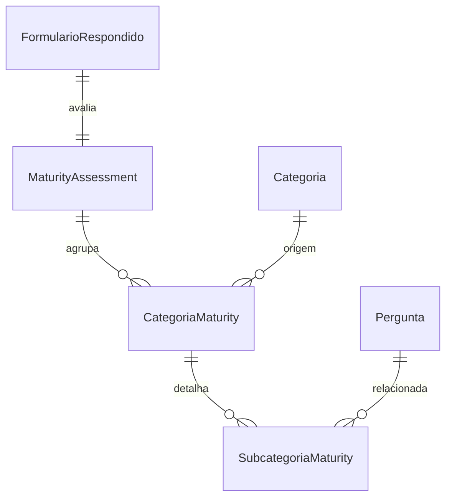

# 📚 Documentação do Banco de Dados - Avaliação de Maturidade

## 🔹 Visão Geral

Este módulo armazena os dados relacionados à **Avaliação de Maturidade** baseada nas respostas de um formulário. Ele agrupa os resultados por categorias e subcategorias, fornecendo indicadores como médias e objetivos para análise de maturidade.

---

## 🧩 Entidades e Relacionamentos

### 📄 MaturityAssessment

| Campo                    | Tipo                            | Obrigatório | Descrição                                 |
| ------------------------ | ------------------------------- | ----------- | ----------------------------------------- |
| id                       | AutoField (PK)                  | Sim         | Identificador único                       |
| formulario_respondido_id | OneToOne → FormularioRespondido | Sim         | Ligação única com o formulário respondido |
| data_criacao             | DateTimeField                   | Sim         | Data de criação                           |
| data_atualizacao         | DateTimeField                   | Sim         | Última atualização                        |

Relacionamentos:

- 1 avaliação → N categorias de maturidade (`CategoriaMaturity`)

---

### 📄 CategoriaMaturity

| Campo                  | Tipo                            | Obrigatório | Descrição                       |
| ---------------------- | ------------------------------- | ----------- | ------------------------------- |
| id                     | AutoField (PK)                  | Sim         | Identificador único             |
| maturity_assessment_id | ForeignKey → MaturityAssessment | Sim         | Avaliação à qual pertence       |
| categoria_id           | ForeignKey → Categoria          | Não         | Categoria de origem (opcional)  |
| nome                   | CharField(100)                  | Sim         | Nome da categoria de maturidade |
| sigla                  | CharField(10)                   | Sim         | Sigla                           |
| media_politica         | DecimalField(3,1)               | Sim         | Média de política               |
| media_pratica          | DecimalField(3,1)               | Sim         | Média de prática                |
| media_total            | DecimalField(3,1)               | Sim         | Média geral                     |
| objetivo               | DecimalField(3,1)               | Sim         | Objetivo desejado               |
| status                 | CharField(20)                   | Sim         | Status de avaliação             |
| tipo                   | CharField(10)                   | Sim         | "FUNCAO" ou "CATEGORIA"         |

Relacionamentos:

- 1 categoria de maturidade → N subcategorias (`SubcategoriaMaturity`)

---

### 📄 SubcategoriaMaturity

| Campo                 | Tipo                           | Obrigatório | Descrição                             |
| --------------------- | ------------------------------ | ----------- | ------------------------------------- |
| id                    | AutoField (PK)                 | Sim         | Identificador único                   |
| categoria_maturity_id | ForeignKey → CategoriaMaturity | Sim         | Categoria superior                    |
| pergunta_id           | ForeignKey → Pergunta          | Não         | Pergunta associada (opcional)         |
| politica              | DecimalField(3,1)              | Não         | Valor de política                     |
| pratica               | DecimalField(3,1)              | Não         | Valor de prática                      |
| objetivo              | DecimalField(3,1)              | Sim         | Objetivo desejado                     |
| descricao             | TextField                      | Sim         | Descrição da subcategoria ou pergunta |
| tipo                  | CharField(12)                  | Sim         | "SUBCATEGORIA" ou "PERGUNTA"          |

---

## 🔗 Relacionamentos (resumo)

