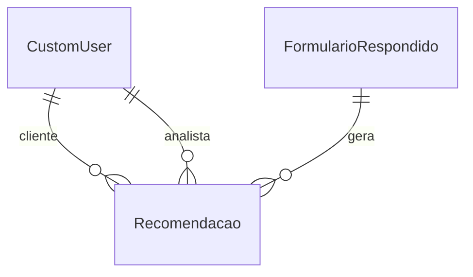

# 📚 Documentação do Banco de Dados - Recomendação

## 🔹 Visão Geral

Este modelo representa as **Recomendações de Segurança e Privacidade** baseadas na análise de um formulário respondido por um cliente. Cada recomendação possui informações detalhadas como categoria, prioridade, urgencia, prazos, justificativas e status de cumprimento.

---

## 🧩 Entidade: Recomendacao

| Campo                 | Tipo                              | Obrigatório | Descrição                                          |
| --------------------- | --------------------------------- | ----------- | -------------------------------------------------- |
| id                    | AutoField (PK)                    | Sim         | Identificador único                                |
| cliente               | ForeignKey → CustomUser           | Sim         | Usuário do tipo cliente                            |
| formulario_respondido | ForeignKey → FormularioRespondido | Sim         | Formulário analisado                               |
| analista              | ForeignKey → CustomUser           | Não         | Usuário analista responsável                       |
| nome                  | CharField(255)                    | Sim         | Nome da recomendação                               |
| categoria             | CharField(50)                     | Sim         | Área da recomendação (ex: Governança, Proteção...) |
| tecnologia            | CharField(255)                    | Não         | Tecnologia relacionada                             |
| nist                  | CharField(50)                     | Sim         | Referência ao controle NIST                        |
| prioridade            | CharField(50)                     | Sim         | Prioridade: baixa, média ou alta                   |
| data_inicio           | DateField                         | Sim         | Início previsto da implementação                   |
| data_fim              | DateField                         | Sim         | Fim previsto da implementação                      |
| meses                 | PositiveIntegerField              | Sim         | Duração do plano em meses                          |
| detalhes              | TextField                         | Sim         | Detalhes da recomendação                           |
| investimentos         | CharField(255)                    | Sim         | Recursos financeiros necessários                   |
| riscos                | TextField                         | Não         | Riscos associados à não execução                   |
| justificativa         | TextField                         | Não         | Justificativa da recomendação                      |
| observacoes           | TextField                         | Não         | Observações extras                                 |
| urgência              | CharField(1)                      | Sim         | Urgência potencial (1 a 5)                         |
| gravidade             | CharField(1)                      | Sim         | Gravidade estimada (1 a 5)                         |
| cumprida              | BooleanField                      | Sim         | Status de conclusão                                |
| data_cumprimento      | DateField                         | Não         | Data em que foi cumprida                           |
| comprovante           | FileField                         | Não         | Documento comprovando execução                     |
| criado_em             | DateTimeField                     | Sim         | Timestamp de criação                               |
| atualizado_em         | DateTimeField                     | Sim         | Última modificação                                 |

---

## ✅ Validações Personalizadas

- **Data de início ≤ Data de fim**
- **Prazo em meses > 0**

---

## 🔗 Relacionamentos

---

## 🔍 Ordenação Padrão

As recomendações são ordenadas por:

1. Prioridade (decrescente)
2. Data final do plano (ascendente)

---

## 🗂️ Choices

- **Categorias:** Governança, Identificação, Proteção, Detecção, Resposta, Recuperação
- **Prioridade:** Baixa, Média, Alta
- **urgencia/Gravidade:** 1 (Muito Baixo) a 5 (Muito Alto)
