# FS3M - Future Security Maturity Monitoring - Manual de Usuário

## 📌 Visão Geral
Sistema de avaliação de maturidade de segurança baseado em **NIST CSF 2.0**, com:
- Frontend em Next.js (React)
- Backend em Django REST Framework
- Arquitetura modular e escalável

## 🙎🏽‍♂️🙎🏽‍♂️ **CLIENTE** 🙎🏽‍♂️🙎🏽‍♂️

## 👋 **Primeiros Passos**
1. Acesse: (http://35.239.165.7:3000/login)
2. Faça login com:
   - Email: `seu@email.com`
   - Senha: `[sua_senha]`
   

   Caso você tenha esquecido a sua senha, clique no botão `ESQUECEU A SENHA?` e coloque o seu email cadastrado:
    - Coloque seu email cadastrado aqui: `seu@email.com`

      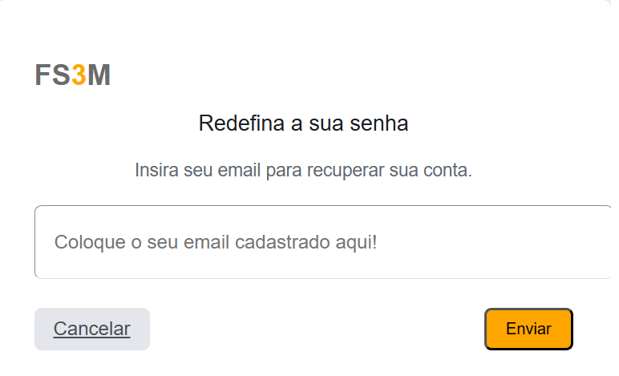
   
   Após inserir o seu email cadastrado e enviar, chegará na sua caixa de entrada um link para que você possa recuperar a sua senha.

## 🚀🚀 **Vamos conhecer o sistema FS3M?** 🚀🚀   

3. Agora que você conseguiu acessar com sucesso ao sistema FS3M. Veja a primeira tela após o seu login.

      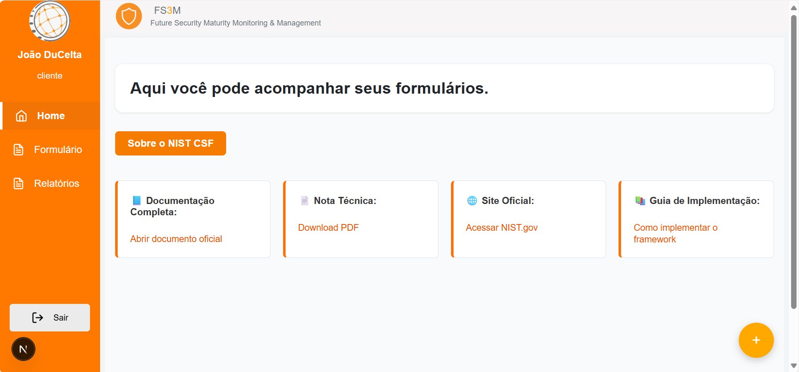

   Perceba que temos 5 campos voltados para o framework `NIST`, são eles:
   - `Sobre o NIST CSF;`
   - `📘 Documentação Completa;`
   - `📄 Nota Técnica;` 
   - `🌐 Site Oficial;`
   - `📚 Guia de Implementação.`

   Vamos falar um pouco sobre os campos mencionados anteriormente:

   `Sobre o NIST`, ao clicar no botão abrirá um PDF contendo toda a informação sobre o framework NIST.

   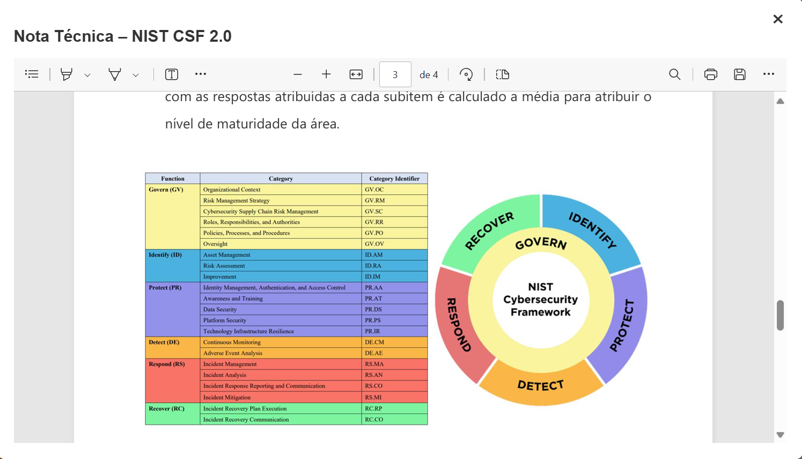

   `Documentação Completa`, ao clicar no botão abrirá um PDF de 492 páginas, contendo a documentação completa referente ao framework NIST.

   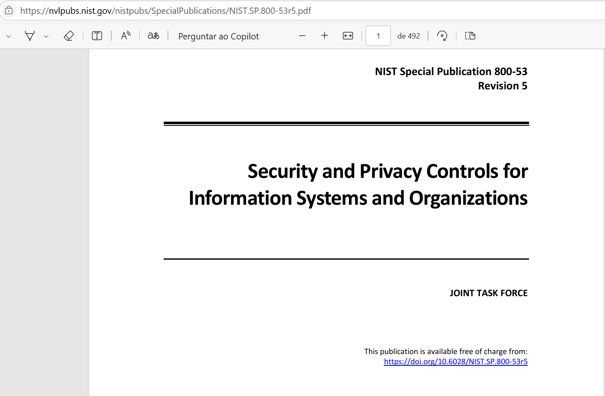

   `Nota Técnica`, ao clicar no botão abrirá um PDF de 4 páginas, contendo explicação sobre a nota técnica referente ao framework NIST.
    
   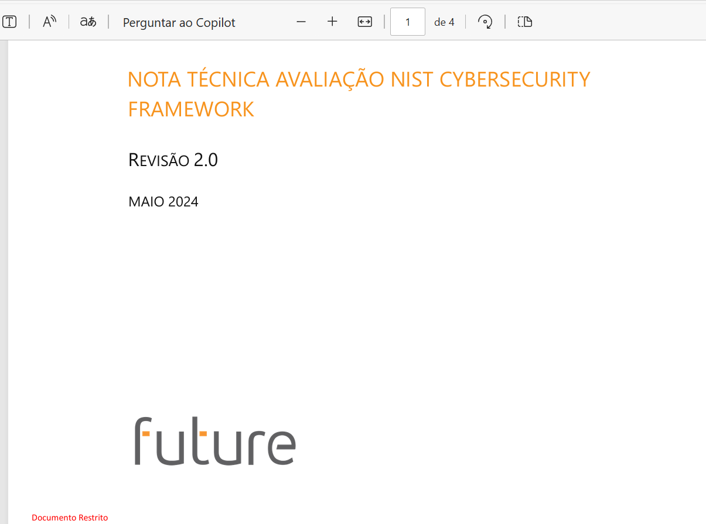

   `Site Oficial`, ao clicar no botão abrirá o site oficial do framework NIST.

   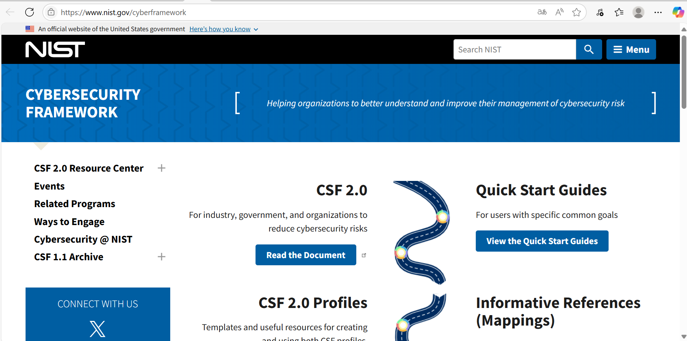

   `Guia de Implementação`, ao clicar no botão abrirá no site oficial do framework NIST, como instalar no seu computador.

   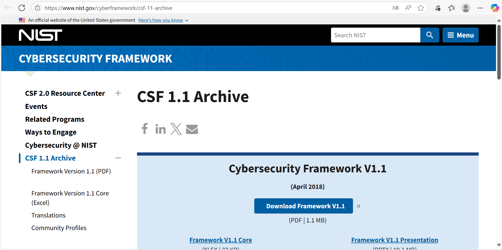

Perceba que ainda temos o botão + no seu canto direito inferior, esse botão permitirá que você consiga todas as redes socias da empresa FUTURE.

   
   Nessa tela você terá 3 tópicos:
   - `HOME;`
   - `FORMULÁRIO;`
   - `RELATÓRIO.`
   
 🥇 A tela `HOME` após você ter preenchido todas as respostas do formulário NIST, você poderá enxergar qual foi o último acesso a este formulário, conforme a imagem abaixo:

   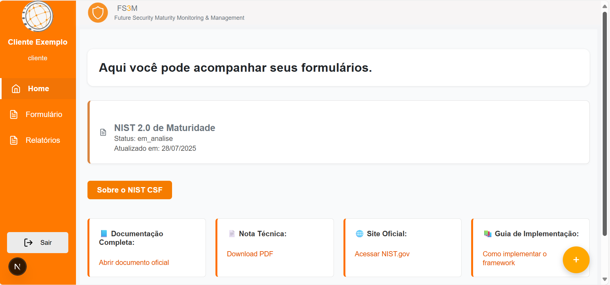
   
  📃  A tela `FORMULÁRIO` permitirá que você enxergue todos os formulários de framework, porém no momento o sistema FS3M usa o framework NIST, outros frameworks serão implementados.

   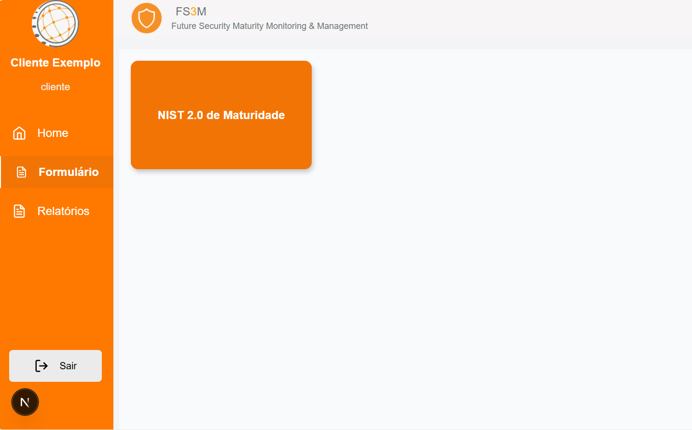

   Após o clique no formulário NIST 2.0, abrirá a tela com 106 perguntas que deverão ser preenchidas, sobre os seguintes temas:
   - `GV - GOVERNANÇA / Com 31 perguntas;`
   - `ID - IDENTIFICAR / Com 21 perguntas;`
   - `PR - PROTEGER / Com 22 perguntas;`
   - `DE - DETECTAR / Com 11 perguntas;`
   - `RS - RESPONDER / Com 13 perguntas;`
   - `RC - RECUPERAR / Com 8 perguntas.`
   
   Essas perguntas, serão respondidas como `POLITICA` e `PRÁTICA.`  
   Sendo politica com as seguintes opções:
   - 1. INICIAL;
   - 2. REPETIDO;
   - 3. DEFINIDO;
   - 4. GERENCIADO;
   - 5. OTIMIZADO.

   E agora, as opções para prática:
   - 1. INICIAL;
   - 2. REPETIDO;
   - 3. DEFINIDO;
   - 4. GERENCIADO;
   - 5. OTIMIZADO.  

   Essa tela permitirá que você coloque informações adicionais e anexe algo importante que queira deixar ao Analista.

   Veja a tela antes de responder o formulário:

  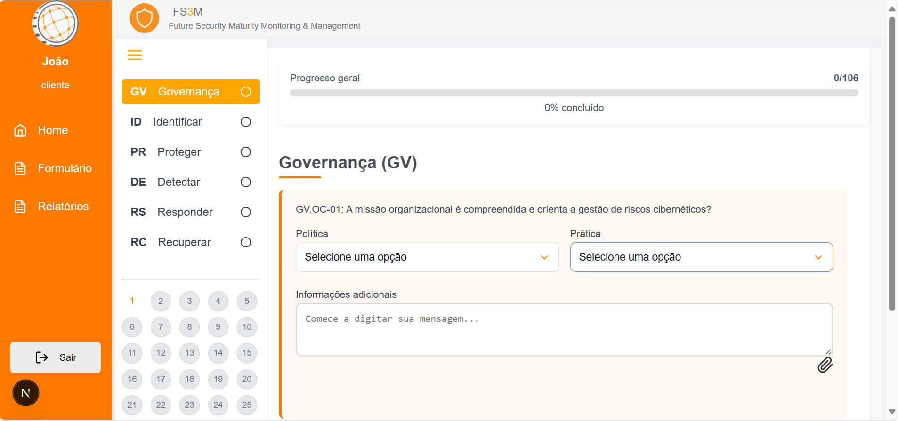

   Veja a tela depois de responder o formulário:
  
  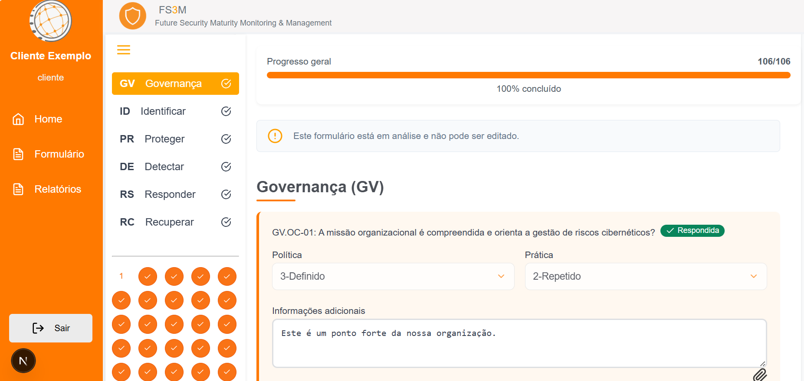

   Perceba que na tela onde as 106 perguntas foram respondidas, temos uma barra de progresso e um check em verdinho para que você não venha se perder.

📋 A tela `Relatório` duas possibilidades à você. 
   - `ANALISE DETALHADA` e `PLANO DE AÇÃO`

   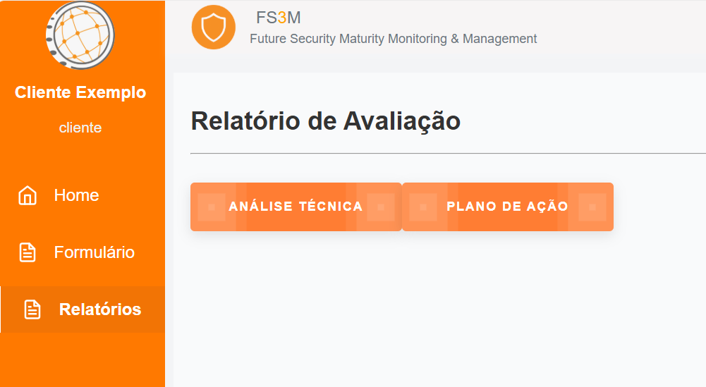

   Em Analise Detalhada você terá um relatório detalhado sobre as 106 perguntas que você respondeu anteriormente.
   Ao abrir a tela de Analise Detalhada, você verá 03 botões:
   - `VER RELATÓRIO;`
   - `BAIXAR RELATÓRIO TÉCNICO;`
   - `BAIXAR RELATÓRIO EXECUTIVO;`

   Logo abaixo desses botões, aparecerá o `GRÁFICO RADAR`  para rápida visualização sobre as suas respostas ao formulário NIST 2.0 e acompanhado a esse gráfico vem a sua pontuação, onde abaixo de 3.00 pontos o sistema reportará atenção para que seja analisado e caso queira, o analista faça recomendação e assim, a pontuação da empresa suba.
 
    Segue a imagem dos 3 botões mencionados:

  

    Segue a imagem do gráfico radar:

  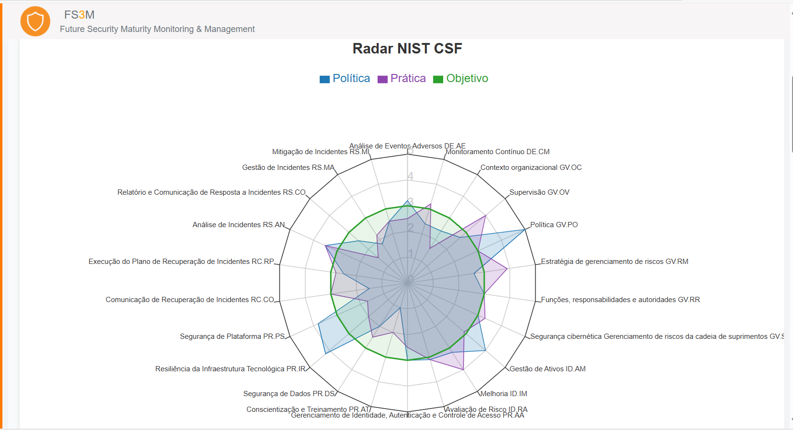

    Segue a imagem da pontuação:

  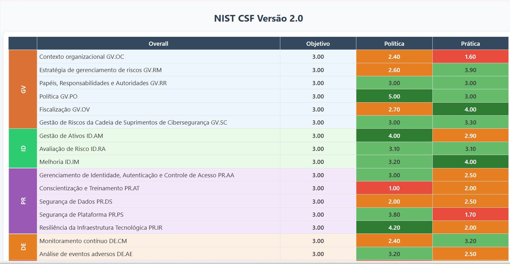

    Segue a imagem da avaliação por categoria:

  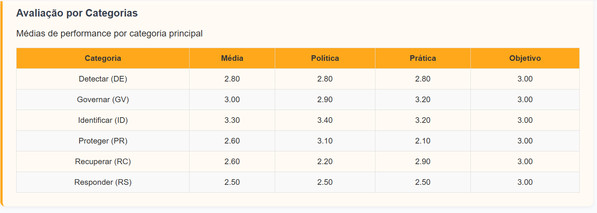

    Segue a imagem da avaliação detalhada/recomendação

  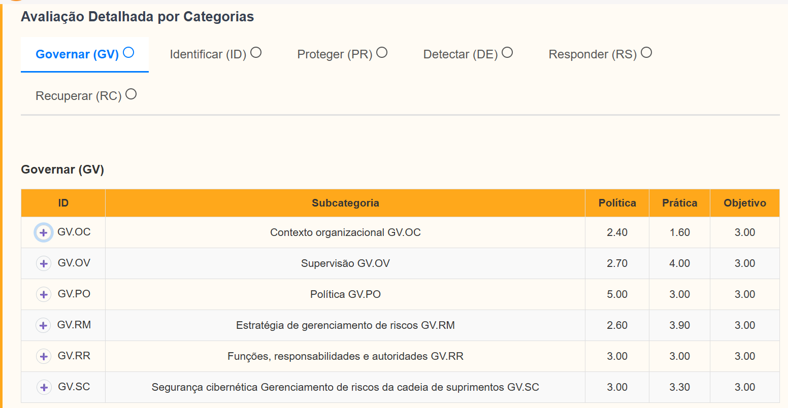

  Abaixo, reportaremos sobre o `PLANO DE AÇÃO`que estará ao lado de `ANALISE DETALHADA`.
  
  Ao clicar em plano de ação, apareça pra você um plano com base na ação do analista sobre as suas respostas do formulário. Entretanto, nesse momento a tela aparecerá vazia, mas mesmo assim, você poderá brincar criando um plano de ação.
  Segue a tela inicial do plano de ação:
 
  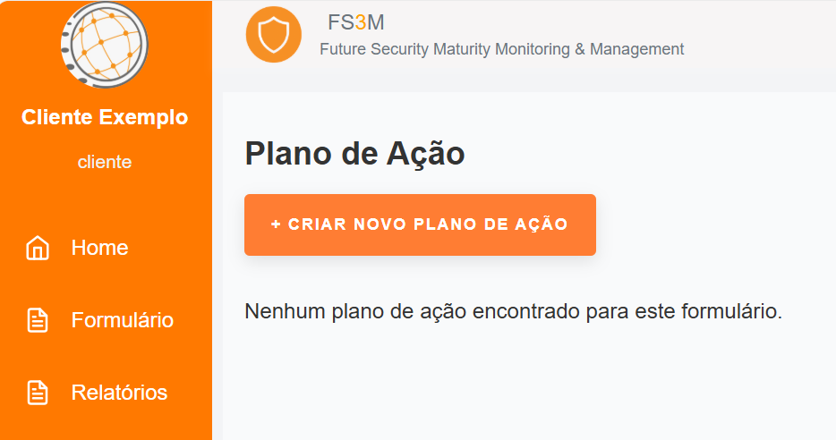

  Apertando o botão `CRIAR NOVO PLANO DE AÇÃO` aparecerá a tela com informações que deverão ser preenchidas e assim, você terá base sobre orçamento a investir em seu negócio.

  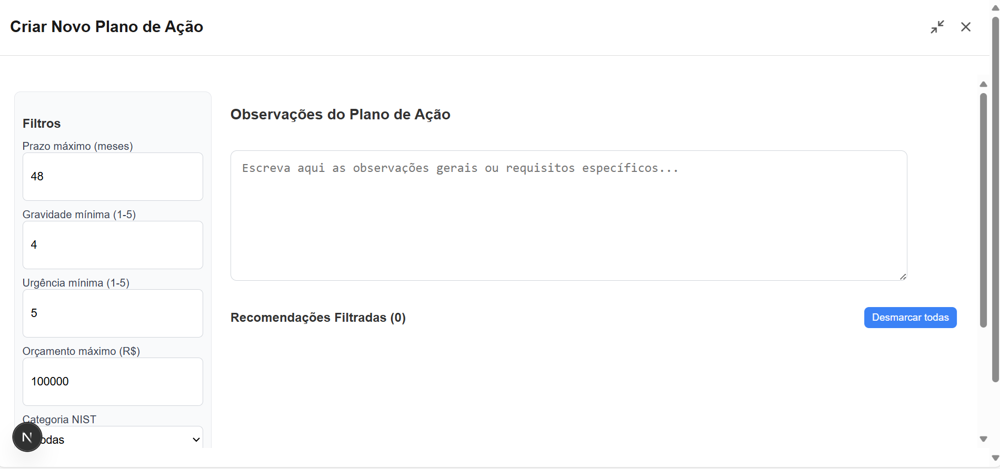

 
 🤩🤩 E assim, terminamos a documentação do cliente. A seguir, falaremos como um `ANALISTA` usará o sistema FS3M. Bora?

---------------------------------------

## 💻💻 **ANALISTA** 💻💻

## 👋 **Primeiros Passos**
1. Acesse: (http://35.239.165.7:3000/login)
2. Faça login com:
   - Email: `seu@email.com`
   - Senha: `[sua_senha]`
   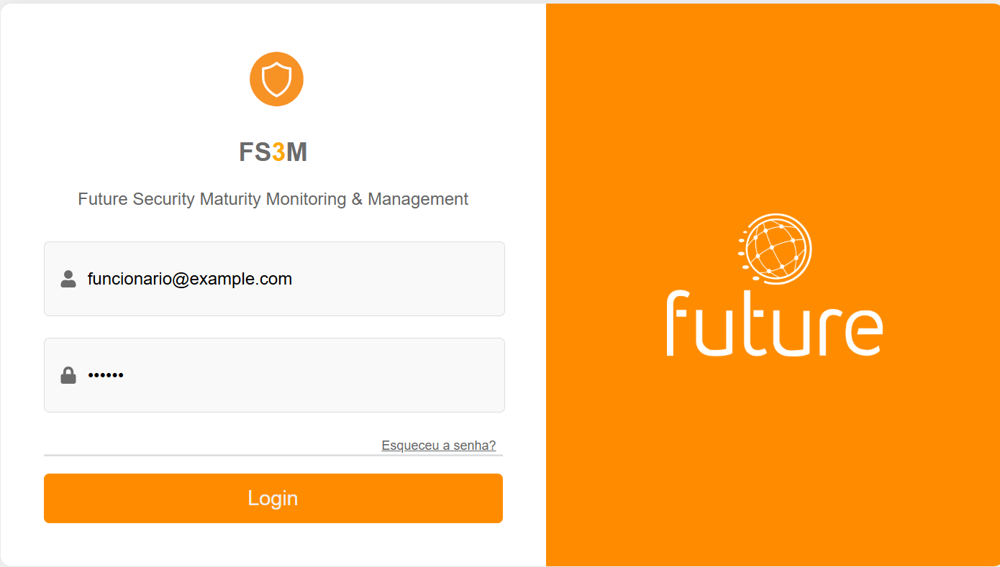

   Caso você tenha esquecido a sua senha, clique no botão `ESQUECEU A SENHA?` e coloque o seu email cadastrado:
    - Coloque seu email cadastrado aqui: `seu@email.com`

      
   
   Após inserir o seu email cadastrado e enviar, chegará na sua caixa de entrada um link para que você possa recuperar a sua senha.

## 🚀🚀 **Vamos conhecer o sistema FS3M?** 🚀🚀   

3. Agora que você conseguiu acessar com sucesso ao sistema FS3M. Veja a primeira tela após o seu login.
   
   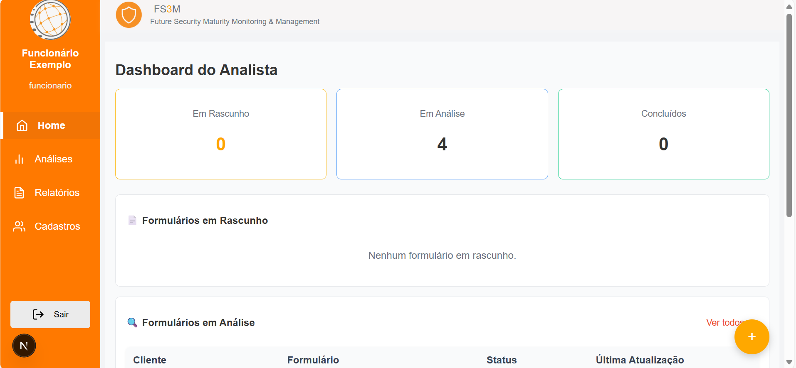

   Na tela em questão, você terá alguns dados importante, são eles:
   
   - `RELATÓRIO RASCUNHO;`
   - `RELATÓRIO ANALISE;`
   - `RELATÓRIO CONCLUIDO;`
   - `FORMULARIO EM RASCUNHO;`
   - `FORMULARIO EM ANALISE;`
   - `FORMULARIO CONCLUÍDOS.`

